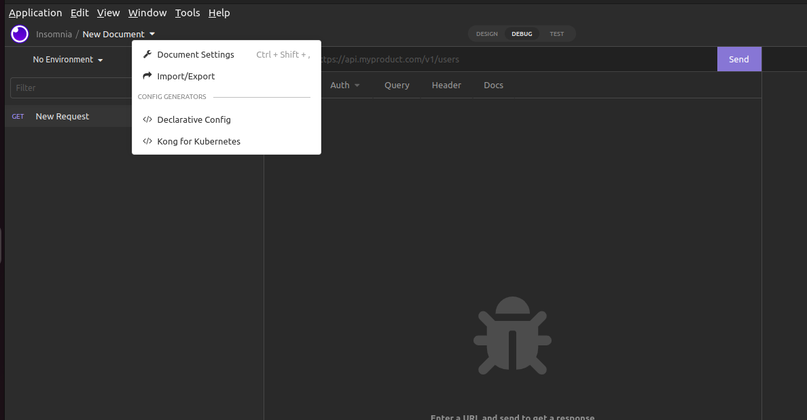
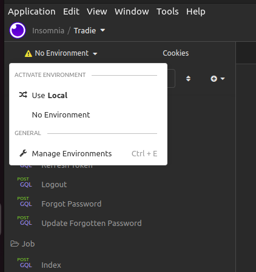
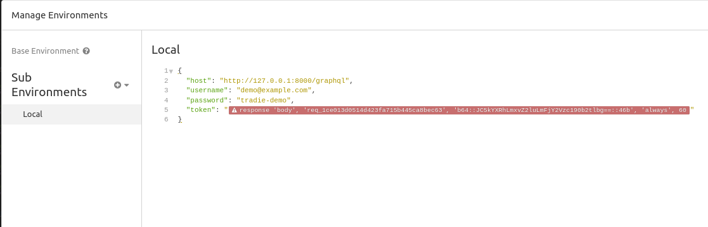

# Tradie

### Overview
Tradie is a back-end application that allowes users (tradies) to create jobs and attach notes and a contact to it.

Tradie has been developed using Laravel Framework and GraphQL.

### Setup local environment:

```sh
git clone git@github.com:notf0und/tradie.git
cd tradie
composer install
```

Edit the file .env and place your database credentials:
```dotenv
DB_CONNECTION=mysql
DB_HOST=YOUR_DB_HOST
DB_PORT=YOUR_DB_PORT
DB_DATABASE=YOUR_DB_SCHEMA
DB_USERNAME=rYOUR_DB_USER
DB_PASSWORD=YOUR_DB_PASSWORD
```

Get back to your terminal and run:
```sh
php artisan migrate
php artisan passport:install
```

The last command will return something like:
```bash
Personal access client created successfully.
Client ID: 1
Client secret: SECRET
Password grant client created successfully.
Client ID: 2
Client secret: SECRET
```

Copy the credentials from the password grant into your .env file
```dotenv
PASSPORT_CLIENT_ID=2
PASSPORT_CLIENT_SECRET=SECRET
```

After that, you should be able to start serving the application by executing:
```shell
php artisan serve
```
If everything work as expected, now you should be able to start using the application.

### App usage

For test the application, it's provided a graphql collection ready to be used with [Insomnia Client](https://insomnia.rest/download)

Once the client is installed on your computer, you should import the file insomnia-collection.yaml located on the root directory of this project.

To import the collection, click on the arrow down at the side of New Document -> Import/Export -> insomnia-collection.yaml


Once it finishes with the import, you should check the "Local" environment is selected and contains the correct host url. (Ctrl+E)






## Registering a tradie and using the app

1) On the folder Auth, there is a Register mutation, if executed, it would create a user.
2) Open the login mutation and execute it, it should return some tokens that would be used by the client.
3) On the folder Jobs, there are 1 mutation and 1 query that can achieve all the tasks required on this test.
4) There is a sub-folder on jobs containing examples of creating jobs, contacts, notes, searching and sorting.


